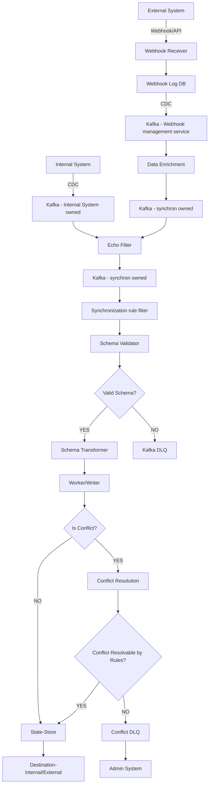

# synchron

Record-to-Record Synchronization Service

A bi-directional synchronization service for handling CRUD operations between internal and external systems.

## Requirements

### Functional Requirements

* Record-to-Record synchronization between two independent systems
  * Internal and External System
    * Internal system is created/managed/maintained by owner
    * External systems are not created by owner, i.e. closed ecosystem, interaction only possible via API calls
* Data transformations are required to map between system's schemas
* Input/output should be validated against predefined schemas
* Sync actions (CRUD) are determined by pre-configured rules or triggers
  * Configurable rules per tenant, per system-type

### Non-Functional Requirements

* External APIs cannot support unlimited requests
  * rate-limited APIs
* Over 300 million synchronization requests daily
* Near real-time latency
  * TBD
* 99.9% availability
* Observability

## Assumptions & Constraints

1. External systems have functionality to send update events via Webhooks. Assuming this as the primary sync trigger.
    1. Polling can be considered a fallback, not considered in this scope given the API rate limits.
2. This system is live/in-use after initial on-boarding sync from External system to Internal system.
    1. We will need to ensure webhook consumption from the same instant snapshot is taken from External system.
3. We will be creating an internal_id and maintaining an `internal_id <-> external_id` mapping per tenant and external system.
4. Changes in Schema are versioned and consequently the transformation implementations would need to be versioned as well, and might require a new release/deployment.
5. Multi-tenant system: We will be having multiple clients, and each client can have multiple systems for synchronization, so we would need to have rate limits and queues partitioned by `(tenant_id, external_system)`.
6. A scheduled reconciliation job for handles missed webhooks.
    1. Polling mechanism required, not considered in this scope given the API rate limits.
    2. Webhook delivery depends on External system and networking, which can under some circumstances lead to failure of synchron being aware of writes to External system.

## Architecture



## Database Schemas

### `record_state`

Tracks sync state for conflict resolution and echo suppression.

```sql
TABLE record_state (
  internal_id               VARCHAR PRIMARY KEY,
  current_version           BIGINT,
  last_synced_at            TIMESTAMP,
  last_known_internal_hash  TEXT,
  last_known_external_hash  TEXT,
  state_data                JSONB
);
```

### `id_mapping`

ID resolution between systems.

```sql
TABLE id_mapping (
  internal_id   VARCHAR,
  external_id   VARCHAR,
  external_system      VARCHAR,
  PRIMARY KEY (internal_id, external_system)
);
```

### `webhook_log`

Incoming webhooks for processing and reconciliation.

```sql
TABLE webhook_log (
  id            UUID PRIMARY KEY,
  external_system      VARCHAR,
  payload       JSONB,
  status        VARCHAR,
  created_at    TIMESTAMP
);
```

## Core Components


| Component          | Responsibility                                                                                                  |
| ------------------ | --------------------------------------------------------------------------------------------------------------- |
| Echo Filter        | Drops echo events to prevent infinite sync loops.                                                               |
| Webhook Receiver   | Validates signatures, normalizes payloads.                                                                      |
| Sync Rule Filter   | Evaluates configured sync rules and filters events.                                                             |
| Schema Validator   | Validates against versioned schemas (Schema Registry/Avro); sends failures to DLQ.                              |
| Schema Transformer | Maps data between internal/external schemas                                                                     |
| Worker/Writer      | Executes rate-limited writes to External/Internal systems; handles retries and conflicts.                       |
| Queue (Kafka)      | Orders events per record, handles back-pressure in case of downstream system rate-limits/incidents.             |
| State-Store        | Maintains ID mappings and sync state. Partitioned/Sharded per tenant.                                           |
| Config Store       | Holds rules for conflict resolution, rate limits, sync logic. Loaded into in-memory cache with sensible TTL     |
| Data Enrichment    | Adds necessary fields, resolves IDs (internal_id <-> external_id).                                              |

## Design Decisions

* We will use `hash(internal_id)` for Kafka partitioning to ensure ordered processing per record.
* We will keep separate topics for Internal->External and External->Internal to prevent slow external writes from blocking incoming webhooks.
* Using Redis for implementing rate-limiting, we will distribute token buckets in Redis keyed by `(tenant_id, external_system)`. Workers will pause/block if tokens are exhausted.
* Plug-in architecture for supporting multiple External systems, each one of them will implement standard interfaces (`create`, `update`, `delete`, `fetch`, `conflict_resolution_config`, `transform_to_internal`, `transform_from_internal`) and provide AVRO schemas for schema validation.
* To avoid poison-pill/head-of-line-blocking we will have retries with exponential backoff and jitter (max 5 attempts) for transient errors (429, 5xx). Permanent errors (4xx) will go directly to DLQ.

## Edge cases

### Loop Prevention

Scenario: synchron writes to External system → External system fires webhook → webhook handler syncs back to Internal system → Internal system's CDC fires → sync writes to External system again → infinite loop.

To prevent infinite loops, we will use the following approaches:

1. Using audit attribute: Check `updated_by` or similar metadata on incoming events and drop the message/event if it matches `synchron`.
2. Echo Cache: We store outgoing payload hashes in Redis with short TTL, and drop incoming webhook/messages if the payload hash matches a recent write.
3. Version/Hash Checks: By comparing incoming payloads against `last_synced_hash` and `last_synced_version` in `record_state`, we can drop stale events/messages.

### Conflict Resolution

When a record is updated simultaneously/concurrently in both Internal and External systems. Our system must be able to identify such cases and it must result in a conflict during synchronization. We will be handling such cases using field level conflict resolution policy defined in config and optimistic locking.

#### Field-Level Policies

Possible conflict resolution policies configurable per-field:

* Last-Write-Wins: Based on `updated_at`.
* Owner-Wins: Internal or External is defined as the source of truth for specific fields.
* Merge: Append changes (e.g., tags, arrays).
* Manual: Push to Conflict DLQ for manual review.

#### Commit Flow

1. Fetch `record_state` and lock row. (Not using SELECT ... FOR UPDATE)
2. Diff incoming event against the last known state.
3. If no fields overlap with concurrent changes, merge cleanly.
4. If fields overlap, apply the configured resolution policy.
5. If unresolved, send to Conflict DLQ.
6. Atomic update `record_state` using the record version. Retry on update failure.

For synchronization from External->Internal system the record_store and record_state can be within same database and utilise batch transaction for best performance and consistency guarantees. This reduces operational over-head, keeps the system simple to implement and manage.
It can also be argued that record_store for Internal system and record_state must have clear system boundaries, which make this similar to case described below.

For synchronization from Internal->External system, the maintenance/management of record_state state create a dual write scenario, where one write can be successful while other fails.

For dual-write scenarios, we can consider following approaches for such cases:

* Implementing 2 phase commit:
    * introduces complication of managing co-ordinator and related complexities (in-doubt scenario, recovery, reconciliation)
* Outbox pattern to update destination stores (External/Internal)
    * introduces increased latency/TAT
    * concurrent modification conditions and subsequent handling
* Retry and push to DLQ
    * If write to record_state is successful, subsequent retries will fail during conflict resolution
        * in this particular case update timestamp of record_state > last update timestamp of Destination(External/Internal) system
    * The messages can then read all data states and try to resolve the final state, or push to Conflict DLQ for manual review

Note: Grouping events by `internal_id` during batch processing can reduce conflicts and DB load.

## Observability

Key areas for monitoring and alerting:

* Kafka consumer lag, Kafka broker
* Database health (CPU, IOPS, latency, cache hits).
* External API latency and error rates (429s, 5xxs).
* DLQ volume (Transient, Conflict, Schema failures).
